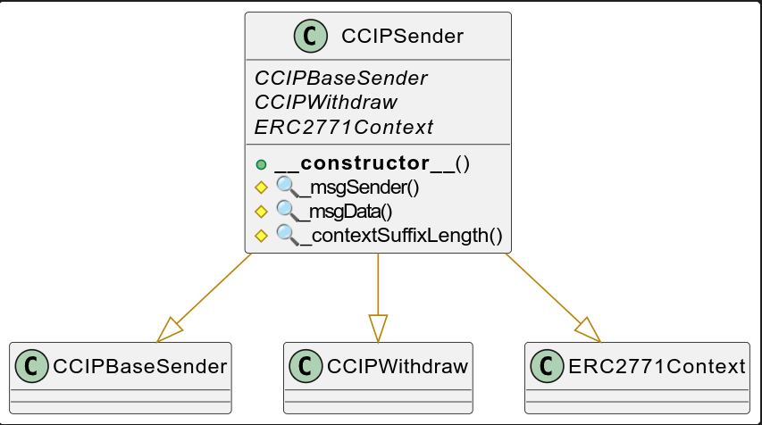

# CCIPSender

> This project is a proof-of-concept to demonstration interactions with the CCIP bridge.
> 
> It's not designed to be production code, it's not security-audited, use at your own risk.

## Overview

A sender contract serves as an entrypoint between your end user and the router contract from Chainlink. This contract is under your control and can be used to offer more possibility of customization.

Notably, this sender contract allows to:

- Compute and pay the fees for the end-user by pre-funding the contract
- Offers gasless transfer for end-user through the standard ERC-2771 (meta transactions)
- Configure which blockchains and fee tokens are available.
- Configure which users is authorized to use the contract

The sender contract will be the main entrypoint for your user to bridge tokens. It will contain all the logic to transfer tokens and send messages.

More information is available in the [CCIP Chainlink website](https://docs.chain.link/ccip) and in the library CCIP in github [smartcontractkit/ccip](https://github.com/smartcontractkit/ccip)

The main reference is the [CCIP masterclass](https://andrej-rakic.gitbook.io/chainlink-ccip/ccip-masterclass/exercise-1-transfer-tokens)

## Configuration and usage

To allow bidirectional transactions, you must deploy the sender contract on each blockchain.

Let's look at the example of a bridge between Polygon and Avalanche.

After deployment of the contracts, the first step is to establish the link between Polygon and Avalanche.

### Allow list chains

We will allow Avalanche to be a destination chain. We call the function `setAllowlistChain()` to do this.

```solidity
function setAllowlistChain(uint64 _chainSelector, bool allowedSourceChain, bool allowedDestinationChain) 
```

 Example:

```solidity
setAllowlistChain(6433500567565415381, false, true)
```

And Polygon too

```solidity
setAllowlistChain(4051577828743386545, false, true)
```

The configuration of the source chain is only useful if we use a receiver contract, but this is not the case for the moment.


### Activate fee tokens

We will now set the fee payment for our two senders contracts.

For Polygon, we will authorize to pay the fees in MATIC, the Polygon PoS native token

For Avalanche, we will authorize to pay the fees in AVAX, the Avalanche native token.

The selected id for native token is zero, the function has to be called in the two blockchains

```solidity
changeStatusFeePaymentMethod(0, true);
```

For non-native token, we use another function `setFeePaymentMethod`: 

```solidity
function setFeePaymentMethod(IERC20 tokenAddress_, string calldata  label_)
```

### Authorize user to use the contracts

Our function `transferTokens` from our sender contract is protected by an access control. Only authorized users can transfer tokens. You have to grant the corresponding role to your brider's users.

```solidity
grantRole(bytes32 role, address account)
```

Example:

```solidity
grantRole(`b0f04d2e44f4b417ab78712b52802767b073e39f75dba9f6e3a31125b053f026`, <Sender address>)
```

### Fund the sender contract

It is important to fund our sender contract to pay the fees.

For that, we will call the function ` depositNativeTokens()` with our account holding native tokens.

### Approve the sender contract

With our bridge user, we authorize the bridge to transfer our tokens in our name.

This is done with the classic ERC-20 `approve` function.


## Module

We divided the code into several components called modules. Each module is responsible to perform specific task.

| **Group**     | **Contract name**    | **Description**                                              |
| :------------ | :------------------- | :----------------------------------------------------------- |
|               | CCIPSender           | Our main contract to deploy                                  |
|               | CCIPBaseSender       | Our base contract providing the public transfer functions    |
| Security      |                      |                                                              |
|               | AuthorizationModule  | Manage the access control                                    |
| Wrappers      |                      |                                                              |
|               | CCIPSenderBuild      | Build a CCIP message                                         |
|               | CCIPContractBalance  | Withdraw native and fee tokens from the contracts            |
| Configuration |                      |                                                              |
|               | CCIPAllowlistedChain | Set and define the blockchain supported by the sender contract. |
|               | CCIPRouterManage     | Store the router contracts address and associated functions  |
|               | CCIPSenderPayment    | Compute fee required to transmit the transfer message        |


## Documentation

Here a summary of the main documentation

| Document                | Link/Files                             |
| ----------------------- | -------------------------------------- |
| Technical documentation | [doc/technical](./doc/technical.md)    |
| Toolchain               | [doc/TOOLCHAIN.md](./doc/TOOLCHAIN.md) |
| Surya report            | [doc/schem/surya](./doc/schema/surya)  |

## Deployment

The main contract is `CCIPSender`. This contract has to be deployed on each source chain where you want perform transfers.



## Usage

*Explain how it works.*


## Toolchain installation

The contracts are developed and tested with [Foundry](https://book.getfoundry.sh), a smart contract development toolchain.

To install the Foundry suite, please refer to the official instructions in the [Foundry book](https://book.getfoundry.sh/getting-started/installation).

## Initialization

You must first initialize the submodules, with

```
forge install
```

See also the command's [documentation](https://book.getfoundry.sh/reference/forge/forge-install).

Later you can update all the submodules with:

```
forge update
```

See also the command's [documentation](https://book.getfoundry.sh/reference/forge/forge-update).


## Compilation

The official documentation is available in the Foundry [website](https://book.getfoundry.sh/reference/forge/build-commands) 

```
 forge build --contracts src/deplyoment/CCIPSender.sol
```

## Testing

You can run the tests with

```
forge test
```

To run a specific test, use

```
forge test --match-contract <contract name> --match-test <function name>
```

See also the test framework's [official documentation](https://book.getfoundry.sh/forge/tests), and that of the [test commands](https://book.getfoundry.sh/reference/forge/test-commands).

### Coverage

* Perform a code coverage

```
forge coverage
```

* Generate LCOV report

```
forge coverage --report lcov
```

- Generate `index.html`

```bash
forge coverage --report lcov && genhtml lcov.info --branch-coverage --output-dir coverage
```

See [Solidity Coverage in VS Code with Foundry](https://mirror.xyz/devanon.eth/RrDvKPnlD-pmpuW7hQeR5wWdVjklrpOgPCOA-PJkWFU) & [Foundry forge coverage](https://www.rareskills.io/post/foundry-forge-coverage)

## Intellectual property

The original code is copyright (c) Taurus 2024, and is released under [MIT license](LICENSE).
